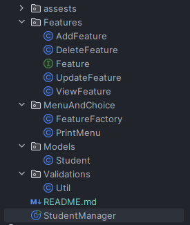
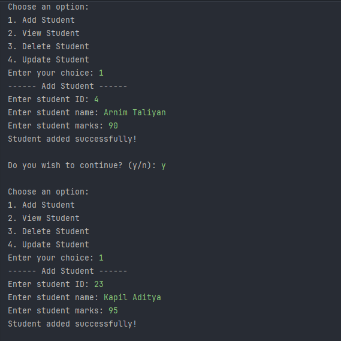
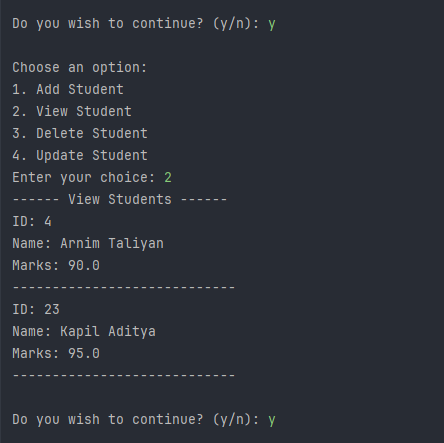
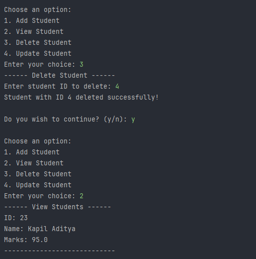
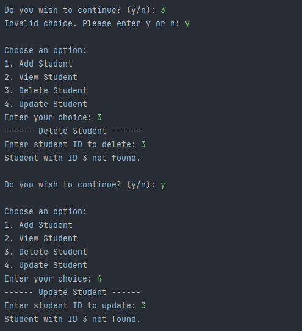
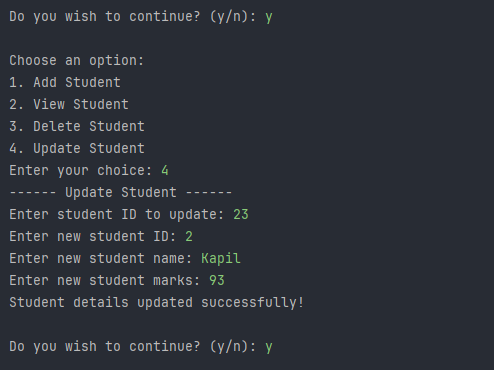
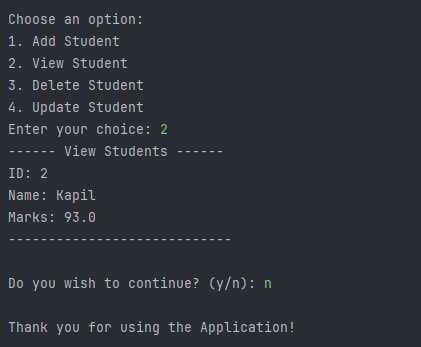

# Java Console Application for Student Management

A simple Java console application to implement **CRUD operations** (Create, Read, Update, Delete) on student records. This project uses `ArrayList`, OOP concepts, interfaces, and utility classes to ensure clean and modular code.

---

## Features

- Add a student (ID, name, marks)
- View all student records
- Delete a student using their ID
- Update student details (ID, name, marks)

---

## Concepts Used

- Classes & Objects
- Encapsulation
- Interfaces
- Loops & Conditionals
- ArrayList (from Java Collections)
- Scanner for input handling
- Input validation
- Factory pattern for feature management
- Modular and clean structure

---

## Tech Stack

- Java 17+
- IDE(IntelliJ)
- Git & GitHub

---

## Project Structure


---

## How to run
1. Clone the repository:
   ```bash
   git clone https://github.com/ArnimTaliyan/elevate-task02-java-student.git
   ```
2. Navigate into the project folder and compile:
   ```bash
   javac StudentManager.java
   ```
3. Run the program:
   ```bash
   java StudentManager
   ```

---

# Output







---

## Learning Outcome
- How to design real-world data structures in Java

- Best practices in object-oriented programming

- Clean coding and modular design

- Console-based input/output and validation handling

---

## End Note
This was completed as part of a Java Developer Internship Task at Elevate Labs, focused on building real-world Java application development experience from scratch.